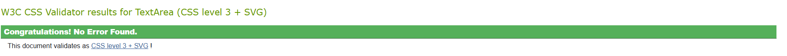
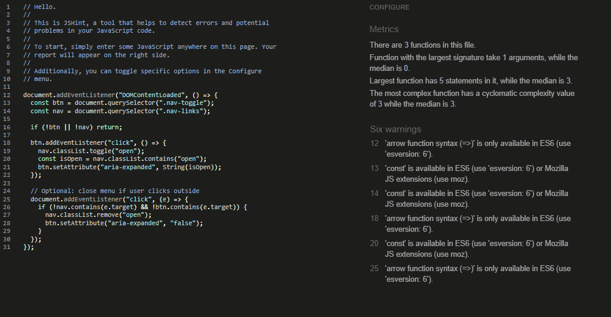
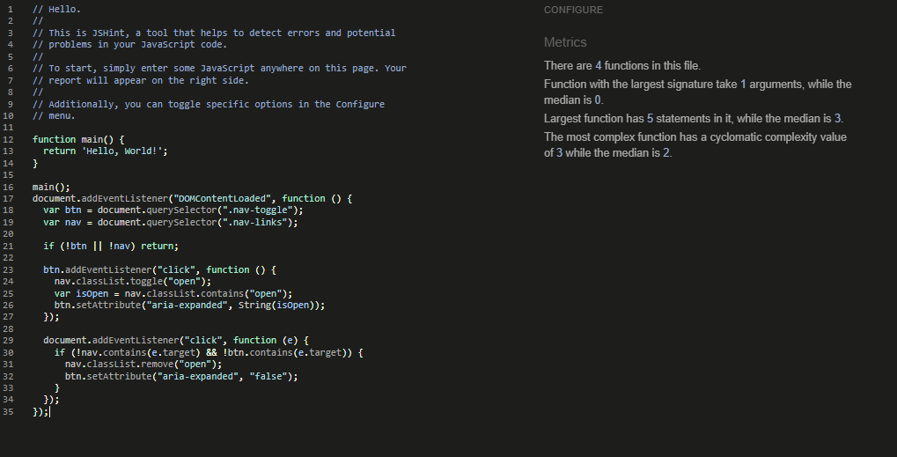
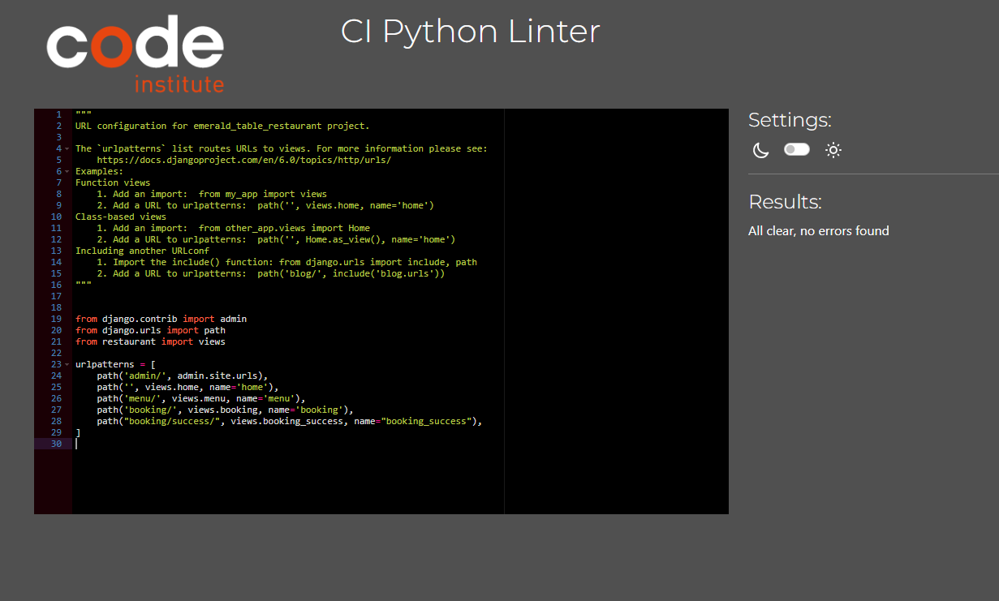
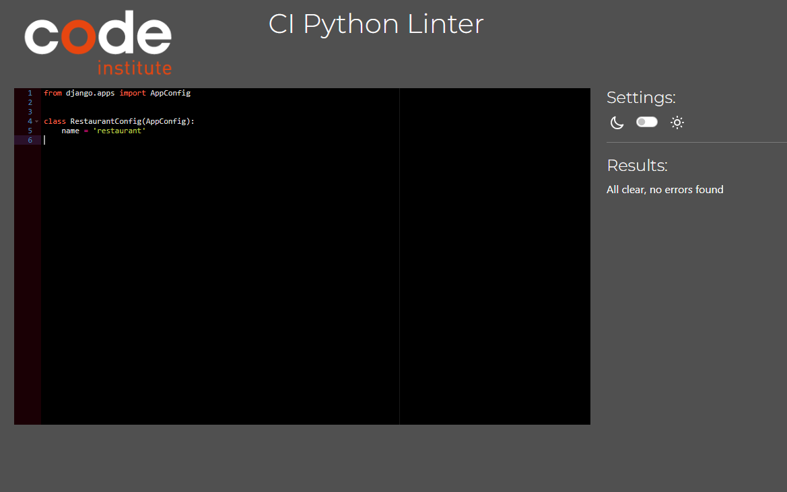
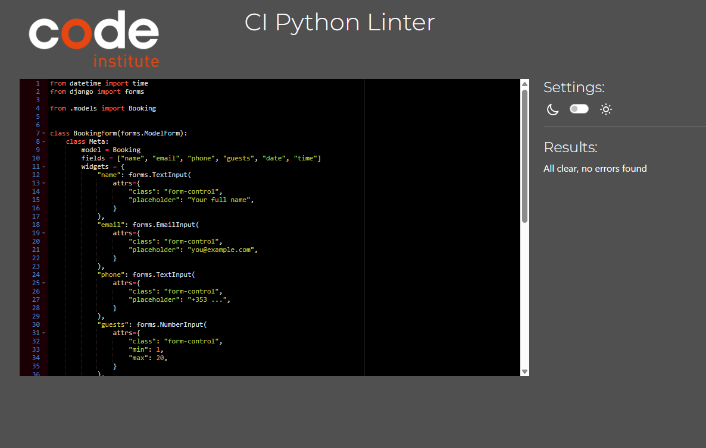
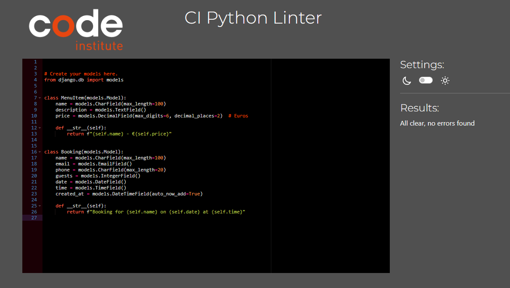

# Testing

## Code Validation

HTML

Minor bugs fixed

Used [HTML W3C Validator](https://validator.w3.org/nu/#textarea) to test HTML file, code was pasted from web page view source

- fixed bug

## CSS

Used [CSS Jigsaw Validator](https://jigsaw.w3.org/css-validator/validator) pass with no errors 

## JavaScript

Used [JShint Validator](https://jshint.com/)

### Bug fixed after replacing *const* to *var*

## Python

Used [PEP8 CI Python Linter](https://pep8ci.herokuapp.com/) (**autopep8** document formatting)

### Validation for Emerald App

- asgi.py 

- settings.py

- urls.py

- wsgi.py

### Validation for Restaurant App 

- 0001_initial.py

- admin.py

- apps.py

- forms.py

- models.py

- views.py

- manage.py

## Lighthouse 

- desktop 

- mobile 

