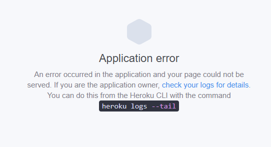
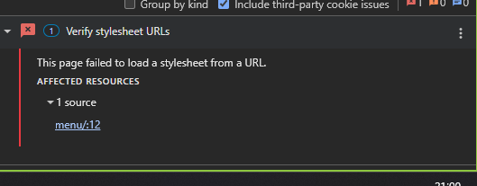
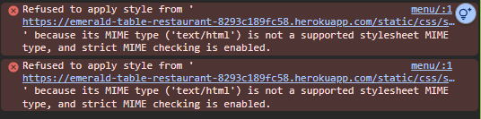

# Bugs Fixed

While building and deploying this project, I ran into a few issues and fixed them during development.

Static files not loading on Heroku (CSS + images)

When I deployed the project, the website loaded but the styling was broken.

### Fix: I configured static files correctly for production using:

STATIC_ROOT

WhiteNoise

collectstatic

Heroku “Application Error” (dyno crash)

At one point the app crashed after deployment and showed an Application Error page.

### Fix: I pinned the Python version using runtime.txt and upgraded Gunicorn.

Procfile was incorrect

Heroku didn’t detect the web process because the Procfile was pointing to the wrong Django project name.

### Fix: Updated Procfile to:

web: gunicorn emerald_table_restaurant.wsgi
Responsive testing website wouldn’t load my site

My site worked normally, but it wouldn’t open inside “Am I Responsive”.

### Fix: Adjusted Django frame settings:

X_FRAME_OPTIONS = "SAMEORIGIN"

